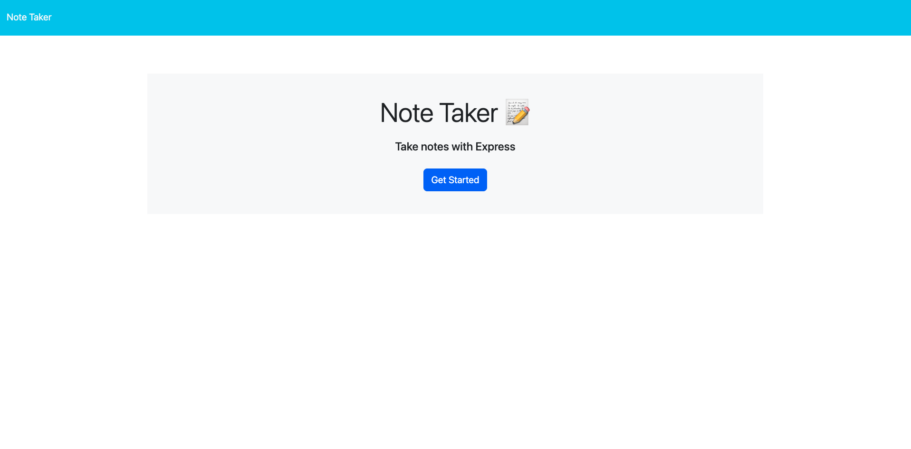

# Express.js Note Taker 

**Description:** Note Taker application that can be used to write and save notes. This application utilizes Express.js will save and retrieve note data from a JSON file.

**User Story:** As a small business owner, I want to be able to write and save notes, so that I can organize my thoughts and keep track of tasks I need to complete.

**Acceptance Criteria:**  
Given a note-taking application... 
 
When I open the Note Taker, then I am presented with a landing page with a link to a notes page. 
 
When I click on the link to the notes page, then I am presented with a page with existing notes listed in the left-hand column, plus empty fields to enter a new note title and the note’s text in the right-hand column. 
 
When I enter a new note title and the note’s text, then a "Save Note" button and a "Clear Form" button appear in the navigation at the top of the page. 
 
When I click on the Save button, then the new note I have entered is saved and appears in the left-hand column with the other existing notes and the buttons in the navigation disappear. 
 
When I click on an existing note in the list in the left-hand column, then that note appears in the right-hand column and a "New Note" button appears in the navigation. 
 
When I click on the "New Note" button in the navigation at the top of the page, then I am presented with empty fields to enter a new note title and the note’s text in the right-hand column and the button disappears. 

**Usage Instructions:**  
1. Open source code in any editor (Visual Studio Code used in demo) 
2. Open the terminal and input "node server.js" in the command line 
3. Navigate to "localhost:3002" in your browser 
4. Click the "get started" button to be directed to the note taker application 
5. Enter your notes, save them or clear them, and reference back to previously created notes 

**Website Link:** 

**Video Walkthrough:** 

**Screenshots:** 
 
Landing Page:   
Demonstrates landing page with link to a notes page 
 

Notes Page:   
Demonstrates existing notes in left-hand column and empty fields to enter a new note title and text in the right-hand column
 

New Note Page:   
Demonstrates the "save note" and "clear form" buttons for a newly created note in the navigation bar
 
